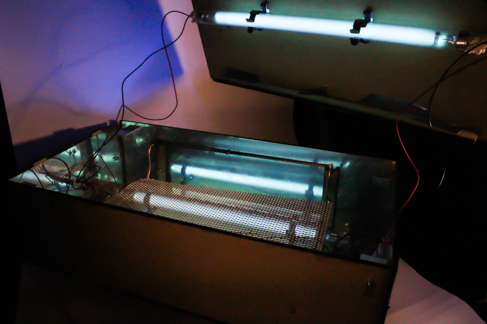

# Sterilo - Portable UV-C Steriliser
## Version 2 is here

## What's new

.png)

Sterilo is an open-source, low-cost portable UV-C sterilizer for decontaminating common surface touchpoints in isolation wards and ICUs. It is designed to be DIY-friendly, allowing the possibility of decentralised manufacturing using locally  available materials.

## Background 

Amidst the raging coronavirus pandemic, sterilization of surfaces and common touch points is the key to prevent cross contamination between patients and healthcare workers and to enhance treatment, within isolation wards and Intensive care units (ICU).

Current surface disinfection methods involve spraying Sodium Hypochlorite solution (NaClO) [1] and alcohol wipes, and rinsing after a waiting time of 30 minutes, repeated 3 times a day. These methods are however not effective [2] against many microbes like bacterial spores [3] and in surfaces with high viral loads. Hence, sterilization is preferred over just disinfection. Even high level disinfectants like 2% glutaraldehyde [4] are ineffective unless exposed for 12 hours. Besides, when the healthcare workers directly come in contact (touch) with these infected surfaces while treating patients, they become carriers of infection, leading to a higher risk of COVID-19 transmission [5] within the isolation ward /ICU.

On the other hand, autoclaves are the gold standard in sterilizing smaller instruments used in ICUs and Isolation wards. Each autoclave cycle takes 30 minutes while the drying process takes an hour to remove steam residue on the instruments.  However, a surge in coronavirus patients in a given hospital might lead to exceeding the capacity of autoclaves.  

There are other disinfection methods such as Fumigation, which uses high level disinfectants like Formaldehyde [7] and Glutaraldehyde [8,9]. This method requires 10 hours of exposure time [10] and another 24 hours for the fumes to be ventilated, after fumigation is carried out in a room. However, currently in many of the Indian government hospitals, the operations resume 30 minutes, that too in poorly ventilated rooms after the fumigation which renders healthcare workers exposed to its harmful fumes. Harmful effects [11,12] include mucous membrane irritation, pulmonary symptoms, Epistaxis, allergic contact dermatitis, asthma.

Ultraviolet radiation is an effective sterilization method, commonly found in Biosafety cabinets. The spectrum between 254nm to 265nm usually called UV-C has the maximum germicidal effect.[13] However, this method is currently not used in hospitals due to its harmful effects to human beings on exposure like skin cancer and eye damage [14].

Existing UVC Sterilizer robots [15] and trolley models [16] that are being introduced in the market to sterilize isolation wards require the people in the ward to vacate the ward while it sterilizes, since it places patients at risk of exposure to UVC radiation. But vacating is not logistically feasible, especially in Indian government hospitals. Hence the main need is to effectively sterilize frequently touched surfaces without causing harmful effects to patients and healthcare workers.

    
  
   

## Need
- ### Surfaces:
Effective sterilization methods for fixed touch points (surfaces) within isolation wards and ICUs.

- ### Complement autoclaves
Supplementary sterilization for instruments, in addition to autoclaves, to reduce their overuse.

- ### Need for reuse of Personal protective equipment
Reuse of N-95 respirators for non-medical staff so that it is available to medical staff working in high viral loads like in isolation wards and ICUs.

# Solution

Sterilo, a portable surface sterilizer that uses UV-C radiation to sterilize common touch points within ICUs and isolation wards, even while the patient is present in its proximity and no special shielding is required. Safety features have been incorporated to avoid accidental exposure to UVC radiation, such that only when it's clamped onto the surface, the UV lamps turn ON.

Sterilo can be used in two configurations:
## A) Clamped onto surfaces
It features suction cups that clamp onto any surface. (See picture below). Once turned ON, the sterilization process runs for 20 minutes and turns off automatically with a beep, so that the user can unclamp it and place it on the next surface.

%20(1).png)

## B) Box type
where a lid with an additional UV-C lamp is placed over configuration A. It is designed to hold most small instruments (for compatibility list see below). A removable mesh holds the instruments in place, while two UV-C lamps below ensures all surfaces of an object are completely exposed.

It is designed to sterilise most of the common touch points within isolation wards and ICUs in hospitals which includes buttons of vital monitors, ventilators, breathing units, pulse oximeters, contact thermometers, N95 masks, other touchpoints such as door handles, plugs, sockets, buttons of control units such as portable X-ray machines, echo machine controls for cardiac patients etc and even surgical equipments such as scissors, shears and tongs. The product is aimed at hospitals, makeshift wards and testing labs.

Helps sterilise the following categories of objects:

- Oximeters: In isolation wards, for severe cases of patients with heart ailments, who also belong to the high risk category of COVID-19, they are monitored with oximeters
- Thermometers: At present, most of the hospitals avoid contactless thermometers because of its inaccuracy, and still rely on normal thermometers which might have more chances of being exposed to a viral load owing to it coming to contact with the COVID-19 patients.
-  N95 Masks: Flow rates drop 1.2 percent every time it is sterilised. However, when there is a shortage of N95 masks, it could be recommended to use the N95 masks after sterilisation. However the life cycle of the N95 masks have to be taken into consideration. (Currently in the hospitals, the doctors go through 6 hour shifts four times a day i.e after every six hour shift, they would need to either reuse the N95 mask or get a new one)
-  Door handles, plugs, sockets (which normally dont fit into an autoclave), surgical equipments such as scissors, clamps, tongs etc
- Buttons of commonly used control units such as portable X-ray machines, breathing unit controls, echo-machine control for cardiac patients and so on.

## Main Features

- DIY- like construction, designed for easy assembly 
- Uses extremely low cost, "off-the-shelf" parts
- Easily replicable using only laser cutting and 3D printing
- Unit mountable onto any surface to sterilize fixed objects
- Unit convertible to an enclosed box: for handheld medical tools
- Innovative design based on adopting UV-C technology in a safe and user-friendly way in a medically accepted standard.
- Shadow elimination- overall illumination by UV-C lamps
- Limit switches avoid UV exposure even in case of mishandling/unintended use cases.
- Durable and Robust Polycarbonate encasing, with sheet metal shielding
- Passive cooling system: avoids fire in case of too much heating
- Miniature Circuit Breaker at power source: to avoid short circuiting, with a 8A fuse next to it, for extra protection
- We invite anyone who is interested to follow this work.

## Experts

Interviews conducted with the following experts during the design process

- Dr. Amar, Field Doctor, Corona Ward, Pune
- Dr. Pravin Deokate, MS Ortho, Sassoon Hospital, Pune
- Dr. Abhiraj Matre, MS Ortho, Sion Hospital, Mumbai
- Dr. Abhinav Gupta, Associate Professor, Jammu University of Internal Medicine
- Dr. Atul Dhakne
- Dr. Mohammed Azhar, Apollo Hospitals, Chennai
- Dr. Sowmya Lakshminarayanan, Post Doctoral Researcher in Microbiology from Padova University, Italy
- Dr. Ram, Manila Hospital
- Dr. Gopalakrishnan.D.R.

## Status of Development

The device is currently under development, a first metal prototype is being realised.

| Date   | Event |
| ----------- | ---------- |
| 23/03/2020  | Start of the project  |
| 05/04/2020  | Research and Need Assessment  |
| 27/03/2020  | Product Development (First iteration)  |
| 30/03/2020  | Concept Development (Second Iteration) |
| 12/04/2020  | First CAD Release Online |
| 13/04/2020  | Prototyping second iteration |
| 18/04/2020  | Expected Date of Completion of the second iteration |

## How to replicate 
See [Assembly Instructions](doc/EN/assembly_instructions.md)

## [For more information, read our wiki](https://github.com/openCOVIDIndia/Sterilo_portable_sterilizer/wiki)

# References
References:
- [1] Weber, D. J., Barbee, S. L., Sobsey, M. D., & Rutala, W. A. (1999). The effect of blood on the antiviral activity of sodium hypochlorite, a phenolic, and a quaternary ammonium compound. Infection Control & Hospital Epidemiology, 20(12), 821-827.
- [2] Koo, D., Bouvier, B., Wesley, M., Courtright, P., & Reingold, A. (1989). Epidemic keratoconjunctivitis in a university medical center ophthalmology clinic; need for re-evaluation of the design and disinfection of instruments. Infection Control & Hospital Epidemiology, 10(12), 547-552
- [3, 4] Rutala, W. A., & Weber, D. J. (2008). Guideline for disinfection and sterilization in healthcare facilities, 2008.
- [5] Rheinbaben, F. V., Schünemann, S., Gross, T., & Wolff, M. H. (2000). Transmission of viruses via contact in ahousehold setting: experiments using bacteriophage φX174 as a model virus. Journal of Hospital Infection, 46(1), 61-66.
- [7] Klein, M. (1963). The inavtivation of viruses by germicides. Proc Annu Meet Chem Spec Manuf Assoc, 116-118.
- [8] Gorman, S. P., SCOTT, E. M., & Russell, A. D. (1980). Antimicrobial activity, uses and mechanism of action of glutaraldehyde. Journal of Applied Bacteriology, 48(2), 161-190.
- [9] Scott EM, Gorman SP. Glutaraldehyde. In: Block SS, ed. Disinfection, sterilization, and preservation. Philadelphia: Lippincott Williams & Wilkins, 2001:361-81.
- [10] Zaidi, M., Angulo, M., & Sifuentes-Osornio, J. (1995). Disinfection and sterilization practices in Mexico. Journal of hospital infection, 31(1), 25-32.
- [11] Schnuch, A., Uter, W., Geier, J., Frosch, P. J., & Rustemeyer, T. H. (1998). Contact allergies in healthcare workers. Results from the IVDK. Acta dermato-venereologica, 78(5).
- [12] Wiggins, P., McCurdy, S. A., & Zeidenberg, W. (1989). Epistaxis due to glutaraldehyde exposure. Journal of occupational medicine.: official publication of the Industrial Medical Association, 31(10), 854-856.
- [13] Russell AD. Ultraviolet radiation. In: Russell AD, Hugo WB, Ayliffe GAJ, eds. Principles and practices of disinfection, preservation and sterilization. Oxford: Blackwell Science, 1999:688-702.
- [14] Sensakovic, J. W., & Smith, L. G. (1982). Nosocomial ultraviolet keratoconjunctivitis. Infection Control & Hospital Epidemiology, 3(6), 475-477.
- [15] “Autonomous Robots Are Helping Kill Coronavirus in Hospitals” IEEE Spectrum: Technology, Engineering, and Science News, spectrum.ieee.org/automaton/robotics/medical-robots/autonomous-robots-are-helping-kill-coronavirus-in-hospitals
- [16] “Flight of the GermFalcon: How a Potential Coronavirus-Killing Airplane Sterilizer Was Born,” IEEE Spectrum: Technology, Engineering, and Science News. [Online]. Available: https://spectrum.ieee.org/tech-talk/aerospace/aviation/germfalcon-coronavirus-airplane-ultraviolet-sterilizer-news.

<!-- # Steps to start documenting the equipment/design you found and chose 
[See this documentation example](https://github.com/CombatCovid/medical-shields-for-3d-printing). You can also download it to see the final result.
1. Download or clone this template to start documenting easily
2. Fill in the source files like STLS, CAD, etc inside

3. Use this one template to create new designs documentation
- Inside docs write down a simple README in language of choice.
- Put in the README.md the reference whre you got the source from to follow up.
- Write down steps to replicate if necessesary as well as guides in sequence.
If this part becomes difficult ask for help here in the [`#how-to-document-designs` channel ]()
 -->
